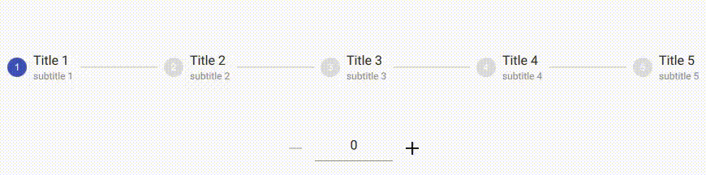
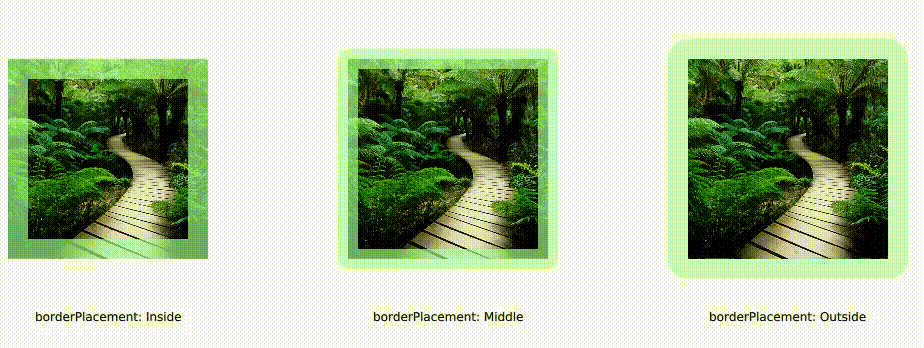

# Qml UI Elements

Some useful qml ui elements. Items don't have any dependencies other than Qt qml modules (unless mentioned otherwise). You can use each file independently.

## CounterMenuItem.qml

A `MenuItem` item with a counter. Does not show zero value.

## InstagramGridView.qml

A `Flickable` item with an inner `Repeater`. `model` property is exposed but unfortunately `delegate` property is not exposed (yet). Suitable for image/video collection.

 

## MaterialDesignIcons.qml

*Dependencies :* `qmldir`

Material design icons collection. Based on version 2.0.46. User must have material-design-icons font installed. This is a singleton qml file (Don't forget to pick `qmldir` file with this one).

## MaterialTextField.qml

A material design `TextField`.

## MultiStateButton

A `ToolButton` with multiple states.

## NonEditableStepper.qml

*Dependencies :* `MaterialDesignIcons.qml`, `StepperStep.qml`

A material Stepper without mouse (touch) interaction. Current step is determined by `currentIndex` property.

## RoundImage.qml

Yet another Round image :) but with border and border placement properties.

